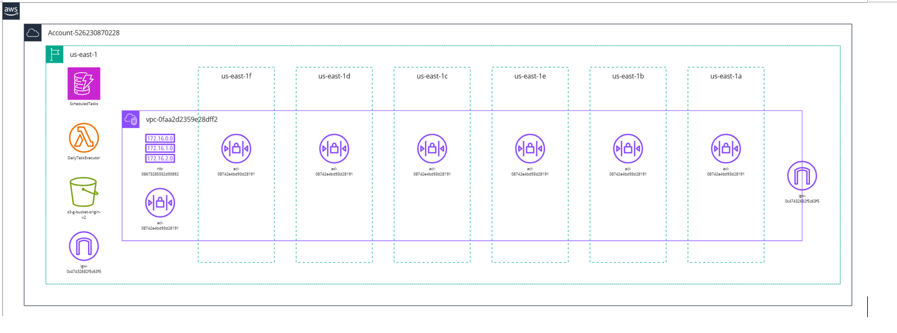

# Daily Task Scheduler with AWS Lambda, DynamoDB, and EventBridge

## Overview

The **Daily Task Scheduler** is a serverless solution built on AWS to automate the execution of daily tasks. The system uses **AWS Lambda** to process tasks stored in **Amazon DynamoDB**, triggered by a schedule configured in **Amazon EventBridge**. This lightweight, scalable architecture ensures tasks are completed on time and statuses are updated in real time.

---

## Architecture

The system consists of the following components:

1. **Amazon DynamoDB**: A NoSQL database for storing scheduled tasks.
2. **AWS Lambda**: A serverless function that processes the tasks and updates their status.
3. **Amazon EventBridge**: Triggers the Lambda function daily at a specified time.
4. **AWS CloudWatch Logs**: Captures logs for monitoring and debugging.



---

## Features

- **Serverless**: Fully managed AWS services minimize operational overhead.
- **Automated Scheduling**: Daily execution of tasks based on a predefined schedule.
- **Scalable**: Dynamically handles any number of tasks.
- **Real-Time Updates**: Task statuses are updated instantly in DynamoDB.

---

## Getting Started

Follow these instructions to deploy the project in your AWS environment.

### Prerequisites

Ensure you have the following:

- An AWS account.
- **AWS CLI** installed and configured.
- An IAM user or role with permissions for Lambda, DynamoDB, and EventBridge.

### Setup Instructions

#### 1. Create the DynamoDB Table

Run the following command to create the `ScheduledTasks` table:

```bash
aws dynamodb create-table \
    --table-name ScheduledTasks \
    --attribute-definitions AttributeName=TaskID,AttributeType=S \
    --key-schema AttributeName=TaskID,KeyType=HASH \
    --billing-mode PAY_PER_REQUEST
```

#### 2. Deploy the Lambda Function

1. Create a ZIP file for the Lambda function:

    ```bash
    zip function.zip lambda_function.py
    ```

2. Deploy the Lambda function:

    ```bash
    aws lambda create-function \
        --function-name DailyTaskExecutor \
        --runtime python3.9 \
        --role <IAM_ROLE_ARN> \
        --handler lambda_function.lambda_handler \
        --zip-file fileb://function.zip
    ```

#### 3. Set Up the EventBridge Rule

Create an EventBridge rule to trigger the Lambda function daily:

```bash
aws events put-rule \
    --name DailyTaskSchedulerRule \
    --schedule-expression "cron(0 9 * * ? *)"
```

#### 4. Add Permissions for EventBridge

Grant EventBridge permission to invoke the Lambda function:

```bash
aws lambda add-permission \
    --function-name DailyTaskExecutor \
    --statement-id EventBridgePermission \
    --action "lambda:InvokeFunction" \
    --principal events.amazonaws.com \
    --source-arn arn:aws:events:<region>:<account-id>:rule/DailyTaskSchedulerRule
```

#### 5. Test the Setup

Invoke the Lambda function manually to test its behavior:

```bash
aws lambda invoke \
    --function-name DailyTaskExecutor \
    --payload '{}' \
    output.json
```

Check the **DynamoDB** table to ensure task statuses are updated.

---

## Example Task Schema

### DynamoDB Table: `ScheduledTasks`

| Attribute Name | Type   | Description                             |
|----------------|--------|-----------------------------------------|
| `TaskID`       | String | Unique identifier for the task.         |
| `TaskName`     | String | Name or description of the task.        |
| `Status`       | String | Current status of the task (e.g., Pending, Completed). |
| `ExecutionTime`| String | Scheduled time for the task execution.  |

Sample Task:
```json
{
    "TaskID": "task1",
    "TaskName": "Daily Backup",
    "Status": "Pending",
    "ExecutionTime": "09:00"
}
```

---

## Monitoring

Logs for the Lambda function are stored in **AWS CloudWatch** under the log group:
```
/aws/lambda/DailyTaskExecutor
```

Use the following command to fetch logs:
```bash
aws logs get-log-events \
    --log-group-name "/aws/lambda/DailyTaskExecutor" \
    --log-stream-name <LogStreamName>
```

---

## Potential Enhancements

- **Task Priority**: Add a priority attribute to process high-priority tasks first.
- **Retry Mechanism**: Implement retries for failed tasks.
- **Custom API**: Use **API Gateway** to manage tasks dynamically.
- **Notifications**: Add SNS or email alerts for task completion or errors.

---

## License

This project is licensed under the MIT License. See the [LICENSE](LICENSE) file for details.

---
