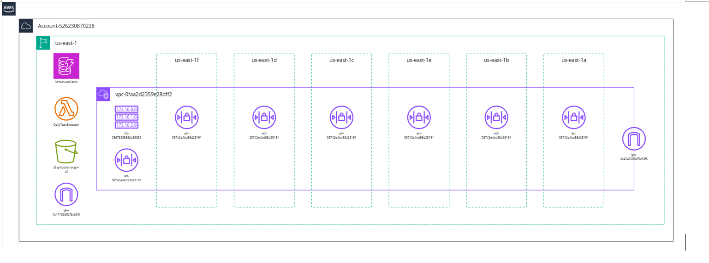

# Architecture Description: Daily Task Scheduler

## Overview

The Daily Task Scheduler is an AWS-based solution designed to automate the execution of daily tasks. This system leverages AWS Lambda, DynamoDB, and EventBridge to process and update tasks efficiently and in real-time. Logs are stored in CloudWatch to monitor performance and debug any issues.

## Architecture Diagram

## Components and Flow

### 1. AWS DynamoDB
- **Purpose**: Stores the tasks that need to be processed daily.
- **Table Name**: `ScheduledTasks`
- **Primary Key**: `TaskID`
- **Attributes**:
  - `TaskID`: Unique identifier for each task.
  - `TaskName`: Description of the task.
  - `Status`: Tracks whether a task is "Pending" or "Completed."
  - `ExecutionTime`: Specifies the time the task is scheduled.

### 2. AWS Lambda
- **Purpose**: Executes the daily tasks by processing items from the DynamoDB table.
- **Function Name**: `DailyTaskExecutor`
- **Runtime**: Python 3.9
- **Execution Role**:
  - Grants access to:
    - DynamoDB (`dynamodb:Scan`, `dynamodb:UpdateItem`).
    - CloudWatch Logs (`logs:CreateLogGroup`, `logs:PutLogEvents`).

**Flow**:
1. Scans the `ScheduledTasks` table for tasks marked as "Pending."
2. Processes each task and updates its status to "Completed."
3. Logs execution details to CloudWatch.

### 3. Amazon EventBridge
- **Purpose**: Triggers the Lambda function daily at a specific time.
- **Rule Name**: `DailyTaskSchedulerRule`
- **Schedule Expression**: `cron(0 9 * * ? *)` (Executes daily at 9:00 AM UTC).
- **Target**: Lambda function (`DailyTaskExecutor`).

### 4. AWS CloudWatch Logs
- **Purpose**: Tracks logs generated by the Lambda function for monitoring and debugging.
- **Log Group**: `/aws/lambda/DailyTaskExecutor`

### Data Flow

1. **Task Storage**: Tasks are added to the DynamoDB table.
2. **Trigger**: EventBridge triggers the Lambda function based on the schedule.
3. **Task Processing**:
   - Lambda scans the table for tasks with `Status = "Pending"`.
   - Processes each task and updates its status to `Completed`.
4. **Logging**: Execution details, including any errors, are logged in CloudWatch Logs.

## Benefits

- **Scalability**: Fully serverless and can scale to handle any number of tasks.
- **Reliability**: Automated scheduling ensures tasks are processed on time.
- **Cost-Effectiveness**: Pay-per-use pricing for AWS Lambda and DynamoDB.

## Potential Enhancements

- **Error Handling**: Add retries for failed tasks.
- **Task Priority**: Introduce a `Priority` attribute to process high-priority tasks first.
- **API Integration**: Use API Gateway to allow external systems to interact with the scheduler.

